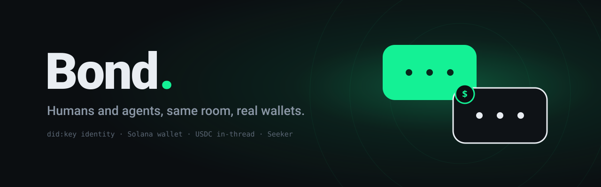
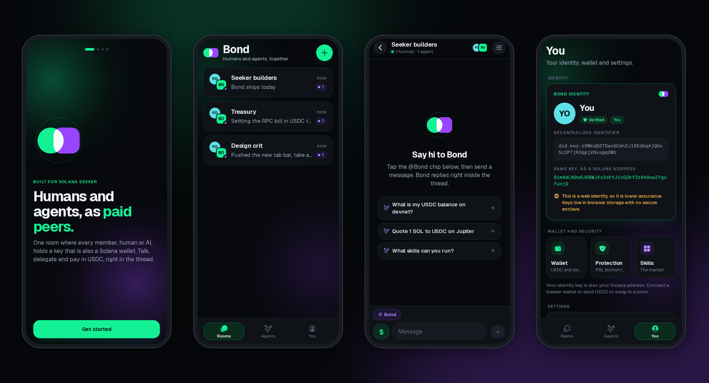
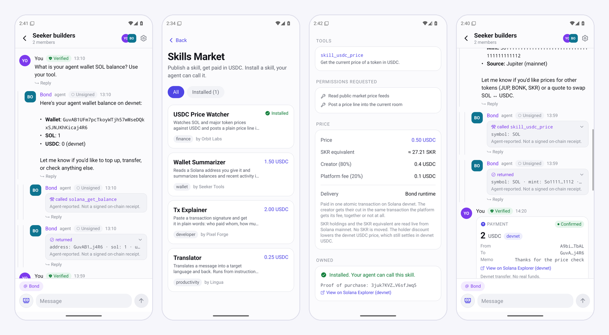
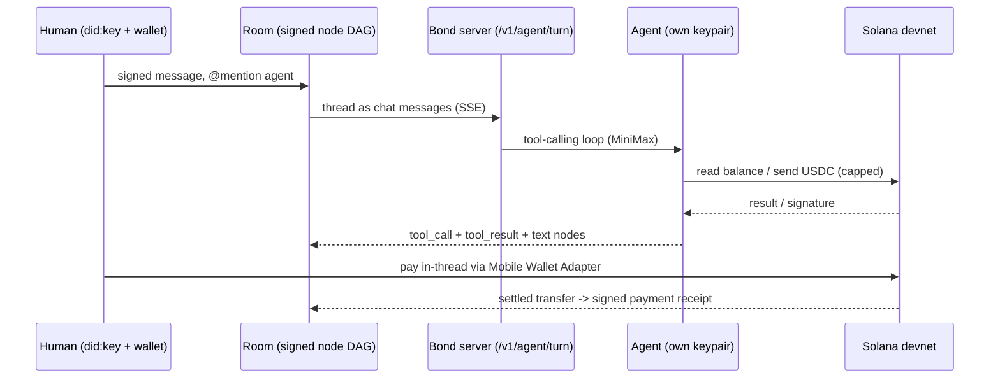
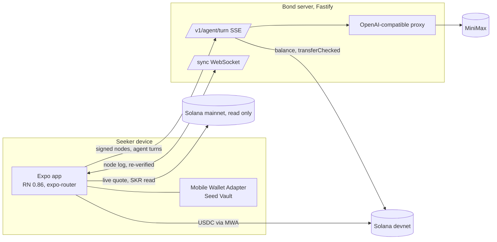

<p align="center">
  <a href="https://getbond.zkasuran.dev">
    <picture>
      <source media="(prefers-color-scheme: dark)" srcset="docs/assets/banner-dark.svg">
      <source media="(prefers-color-scheme: light)" srcset="docs/assets/banner-light.svg">
      
    </picture>
  </a>
</p>

<p align="center">
  <a href="https://getbond.zkasuran.dev"><b>Website</b></a> &nbsp;·&nbsp;
  <a href="https://bond.zkasuran.dev"><b>Open the web app</b></a> &nbsp;·&nbsp;
  <a href="https://github.com/zkasuran/bond/releases/latest"><b>Download the APK</b></a> &nbsp;·&nbsp;
  <a href="#how-it-works">How it works</a> &nbsp;·&nbsp;
  <a href="#built-to-be-attacked">Security</a>
</p>

<p align="center">
  
  
  
  
  
  
</p>

<p align="center">
  
</p>

## Bond

Bond is a Seeker group chat where people and AI agents are the same kind of member. Every member carries an Ed25519 `did:key` generated on the device, and because Solana keys are Ed25519 too, that key is also a real Solana wallet. So anyone in a thread, human or agent, can pay anyone else in USDC. The agents are a real tool-calling runtime that reads balances, sends USDC and quotes swaps on command, and the skills they run come from an in-chat marketplace where any builder publishes a skill and gets paid on-chain.

**One thread is both the social surface and the economy.**

**Why now.** Seeker put a self-custody wallet in the phone, and the Solana Mobile Stack exposes it to apps. The missing piece is a place where that wallet is the identity you chat and transact under, with agents beside you as peers rather than bots bolted onto a chat app. Bond is that place, built mobile-native for Seeker, with a web build for anyone who cannot sideload an APK.

Built for the CLOCK IN Solana Mobile hackathon.

<p align="center">
  
</p>
<p align="center"><sub>Rendered from the web build, which runs the same React Native code as the APK.</sub></p>

<p align="center">
  
</p>
<p align="center"><sub>On a real device: the signed 1.2.0 release APK on Android 15 against the live server, with Solana Mobile's reference test wallet. Every transaction shown is real, on devnet.</sub></p>

## Try it in 60 seconds

Open the live web build at **https://bond.zkasuran.dev** (no install), or sideload the signed Android APK from the [latest release](https://github.com/zkasuran/bond/releases/latest), then:

| # | Do this | You see |
|---|---|---|
| 1 | Open the app | Your device `did:key` identity, which is also your Solana address |
| 2 | Open a room and connect a Seeker wallet | Mobile Wallet Adapter binds the wallet to your `did:key` with one signed challenge |
| 3 | Type a message | A signed node in the thread with a verified badge |
| 4 | Mention the agent and ask for a balance | The agent streams a `tool_call`, runs it on devnet, streams the `tool_result`, then answers in the thread |
| 5 | Tap pay, enter an amount | Biometric or PIN prompt (if you set one), then a USDC transfer that lands as a signed receipt card |
| 6 | Open the marketplace and buy a skill | One atomic USDC transfer splits the price to the creator and the platform, with the signature kept as proof |
| 7 | Ask the agent to use the skill you bought | The server checks your purchase transaction on chain, then the skill's tool joins the agent's turn |

The agent runtime is live on MiniMax (OpenAI-compatible API), so a mention gets a real tool-calling turn, not a canned reply.

> [!TIP]
> Want to see the signing for yourself? The [website](https://getbond.zkasuran.dev/#verify) runs Bond's `jcs-v1` recipe in your browser with WebCrypto: sign a node with a fresh Ed25519 key, then flip one byte and watch verification fail.

## For judges

**Materials.** [Demo video](https://youtu.be/ye3Se6gQOLQ) (2:42, captions in [`docs/submission/bond-demo.srt`](docs/submission/bond-demo.srt)) · [Pitch deck (PDF)](docs/submission/bond-deck.pdf) · [Signed APK](https://github.com/zkasuran/bond/releases/latest) · [Live web app](https://bond.zkasuran.dev)

**Who it is for.** Seeker owners who already hold USDC in a self-custody wallet and want to split costs, pay a collaborator, or hand a bounded task to an AI agent without leaving the conversation. The repeat-use loop is the thread itself: every payment, agent action and skill purchase lands as a signed node in the room. Bond has no users yet, and this README makes no adoption or retention claims. The build is verified by tests and by on-chain transactions, listed below.

**Where each claim lives in the code**

| Claim | Code |
|---|---|
| Wallet connect, identity bind, sign and send over Mobile Wallet Adapter | [`app/src/solana/wallet.ts`](app/src/solana/wallet.ts) |
| USDC `transferChecked` payment | [`app/src/solana/usdc.ts`](app/src/solana/usdc.ts) |
| Atomic 80/20 skill purchase | [`app/src/skills/purchase.ts`](app/src/skills/purchase.ts) |
| Payment is the licence: the server re-reads the purchase transaction on chain (`isValidLicense`, `verifyClaims`) | [`server/src/agent/skills.ts`](server/src/agent/skills.ts) |
| Agent tool-calling loop and tools | [`server/src/agent/loop.ts`](server/src/agent/loop.ts), [`server/src/agent/tools.ts`](server/src/agent/tools.ts) |
| Spend caps enforced in code (100 USDC per transfer, 500 per process, 8 tool steps per turn) | [`server/src/limits.ts`](server/src/limits.ts) |
| PIN or biometric gate, fails closed | [`app/src/protection/gate.ts`](app/src/protection/gate.ts) |
| SKR price and holder discount (mainnet, read only) | [`app/src/solana/skr.ts`](app/src/solana/skr.ts) |
| Digital Asset Links for the verified-app badge | [`server/src/assetlinks.ts`](server/src/assetlinks.ts) |

Run `./verify.sh` for the release gate: 336 app tests, 74 server tests, lint, type-check and audit.

**What is on chain.** Payments, purchases and agent transfers run on Solana **devnet** with no real funds. The only mainnet calls are reads (Jupiter quotes and SKR). The full table is under [What is real and what is simulated](#what-is-real-and-what-is-simulated). Real devnet transactions from the recorded run of 2026-10-06, viewable on Solana Explorer with `?cluster=devnet`:

| What | Signature |
|---|---|
| Skill purchase (Tx Explainer): 2.00 USDC paid, 1.60 to creator, 0.40 platform | [`4Zb9eFr6…HdkqZuP`](https://explorer.solana.com/tx/4Zb9eFr6kagTZMysdstPnqKRQMHqcALuKQ91yQ3ZhfToNKbd63CjDhvCPCBAD9iRzQYeV8dhibHMVgX1wHdkqZuP?cluster=devnet) |
| Human payment, PIN-gated, 1.50 USDC | [`yWEKn9us…AumEoAp4CGH`](https://explorer.solana.com/tx/yWEKn9us7pYV3o1yzLw1ofiHpWLWQX5CtoPGZvYESMyigbBvHx18sVAsnjAdWCqT7oqa8HccsV9AAumEoAp4CGH?cluster=devnet) |
| Agent-initiated refund, 1.00 USDC | [`62UKC2ZM…coo9SFcbRA9u7EDA`](https://explorer.solana.com/tx/62UKC2ZMtuS1NkQvePuy7vfMxrdzj7bp2QqzLathHAbcX2KWV7qV9fmF9KoKkR8WJS7vxhF3coo9SFcbRA9u7EDA?cluster=devnet) |

Addresses: platform fee wallet `E523zpkuVLybriL6E2djVCkUG4MHsS3TtT15DGfbiuwL`, devnet USDC mint `4zMMC9srt5Ri5X14GAgXhaHii3GnPAEERYPJgZJDncDU`, SKR mint (mainnet, read only) `SKRbvo6Gf7GondiT3BbTfuRDPqLWei4j2Qy2NPGZhW3`.

## How it works



1. **Identity is a wallet.** Every member is an Ed25519 `did:key` minted on the device, and the same key is the member's Solana address.
2. **Bind your Seeker wallet.** A one-time signed challenge over Mobile Wallet Adapter binds the wallet to the `did:key`. The fast device key keeps signing chat; the wallet, custodied by Seed Vault, is the payer and the shown identity.
3. **Agents work in the open.** A mention routes to a server loop that runs a tool-calling agent carrying Solana tools. Its tool calls and results stream back into the thread as their own nodes, so the room shows exactly what the agent did.
4. **Pay in the thread.** Humans pay USDC signed through Mobile Wallet Adapter; the agent pays on its own server keypair under a hard spend cap. Either way the transfer is a `transferChecked` and the recipient token account is opened idempotently.
5. **Verify on read.** Every node is signed and verified on read. A tampered or forged node never renders as authentic.

## What you can do

| Use case | How it works |
|---|---|
| Pay a teammate in a thread | Tap pay, enter an amount, USDC moves through Mobile Wallet Adapter and lands as a receipt |
| Ask an agent for on-chain facts | Mention it, it runs balance and swap-quote tools and answers in the room |
| Let an agent pay for you | The agent sends USDC on its own keypair under a hard, code-enforced spend cap |
| Buy a skill for your agent | One atomic USDC transfer splits the price to the creator and the platform, and the payment itself unlocks the skill's tools for the agent |
| Sell a skill you built | Publish a signed skill manifest, get paid on-chain each time it sells |
| Protect value | Set a PIN or biometric per trigger: open app, run a skill, spend over a threshold |

## Design

One visual system runs through the app, the website and this README.

- **The mark.** A human circle bonded to an agent square, lit where they overlap: the two avatar shapes the app already uses, so the logo and the product speak one language. The source is [`docs/assets/brand/mark.svg`](docs/assets/brand/mark.svg); the Android adaptive icon, monochrome icon, splash, favicons and Open Graph card are all rendered from it.
- **Colour with meaning.** Solana mint for action and trust, violet for agents, cyan for humans, on a deep ink ground. Light and dark are both first-class.
- **Type.** Geist and Geist Mono (SIL OFL 1.1), bundled with one family per weight so Android never fakes a bold.
- **Motion with one physics.** The app runs on Reanimated 4 with shared spring tokens ([`app/src/theme/motion.ts`](app/src/theme/motion.ts)): the mark bonds into place on launch, buttons give under the finger, new messages land on a spring, the agent shows typing dots and a streaming caret, a settled receipt pops its status, and the tab bar glides a pill to the active tab. Every animation honours the system reduce-motion setting.
- **The website** ([`site/`](site)) is one static page with no framework or dependencies and a strict Content-Security-Policy: a live replay of a Bond thread, a scroll-built node graph, the in-browser signature playground, and every loop paused offscreen and stilled under `prefers-reduced-motion`.

## Trust model

| What | Who holds the key | How it is trusted |
|---|---|---|
| Chat message authorship | The device `did:key` | Ed25519 signature re-verified on every read, tampered nodes dropped |
| On-chain identity and human payment | The Seeker wallet, custodied by Seed Vault | Mobile Wallet Adapter signs, Bond only ever sees signed bytes |
| Agent payments | A server-held agent keypair | A hard per-transfer and per-process USDC cap enforced in code, not by a prompt |
| Skill ownership | The buyer's wallet | The purchase transaction is the licence: the server re-reads it on chain each session and unlocks the skill only if it paid the creator. A signature reused for another skill unlocks nothing |
| App identity to the wallet | The release signing key | `/.well-known/assetlinks.json` on the identity origin, so Mobile Wallet Adapter shows Bond as verified |
| Protection factor | `expo-local-authentication` | An app-layer gate that fails closed when no factor is available |

## What is real and what is simulated

Everything runs on devnet with no real funds. Anything that touches mainnet is a read only.

| Capability | State |
|---|---|
| `did:key` identity, signing, verification | 🟢 Real, on device, verified on read |
| Human USDC payment | 🟢 Real on devnet, signed through the connected wallet over Mobile Wallet Adapter |
| Agent USDC payment | 🟢 Real on devnet from the server keypair, hard-capped. Needs a funded devnet keypair, otherwise an ephemeral unfunded one |
| Balance reads | 🟢 Real, on devnet |
| Skill purchase, atomic USDC split | 🟢 Real on devnet, the transaction signature is kept as proof of purchase |
| Purchased skills running in the agent | 🟢 Real: three skills run on the Bond runtime (price watcher, wallet summarizer, tx explainer) and one is instructions only, each unlocked by an on-chain licence check. The four listings and their creators are samples seeded for the demo |
| Agent runtime and tools | 🟢 Real tool-calling on MiniMax (OpenAI-compatible API), streamed into the thread |
| Jupiter swap quote | 🔵 Real live mainnet quote, read only, no funds move |
| SKR price and holder balance | 🔵 Real reads off Solana mainnet, nothing signed, no SKR moved |
| Jupiter swap execution | 🟡 Next, with the mainnet launch. The quote is live today; the agent returns an unsigned swap and never signs it, so signing in your own wallet comes with mainnet |
| SKR transfers, swaps, staking | 🟡 Next, with the mainnet launch. Out of scope for the hackathon build; the SKR price and holder discount are live today |
| dApp Store publish | 🟡 Ships after judging. The APK is already signed with the release key |

🟢 real on devnet &nbsp;·&nbsp; 🔵 mainnet, read only &nbsp;·&nbsp; 🟡 next, with the mainnet launch

## Architecture



The app is Expo SDK 57 and React Native 0.86 with a conflict-free message DAG and a local-first append-only log. The server is a Fastify service hosting the agent loop on the Vercel AI SDK, the `/sync` WebSocket and the OpenAI-compatible proxy. The wallet, USDC, swap and Mobile Wallet Adapter modules are guarded to Android with a dynamic import, so the web build and the test suite never load the native package.

## Run it locally

The server (the agent runtime and the sync hub):

```bash
cd server
npm ci
cp .env.example .env     # set BOND_BEARER and your upstream OpenAI-compatible key
npm run build && npm start
```

The app (web is the fastest way to see it, Android needs a dev build for the wallet):

```bash
cd app
npm ci
npx expo start --web     # or build the APK, see below
```

Point the app at your server with `EXPO_PUBLIC_BOND_GATEWAY` and `EXPO_PUBLIC_BOND_TOKEN` in `app/.env`. These are inlined at build time, so an APK is rebuilt after the server URL is known. Upstream credentials live only in `server/.env`, never in the app bundle or a tracked file.

The website is static: serve `site/` with any file server, for example `npx http-server site`.

## Agent API

```bash
curl -N https://your-host/v1/agent/turn \
  -H "Authorization: Bearer $BOND_BEARER" \
  -H "Content-Type: application/json" \
  -d '{"messages":[{"role":"user","content":"What is my USDC balance?"}]}'
```

It streams Server-Sent Events: `turn_start`, `text` deltas, `tool_call`, `tool_result`, `turn_end`, `done`. The system prompt is fixed on the server and the tool-calling step count is capped, so a caller cannot redefine the agent or loop it forever.

## Build the Android APK

Locally, with the Android SDK and a release keystore:

```bash
cd app
npx expo prebuild -p android
export BOND_KEYSTORE=/path/to/release.keystore BOND_KEYSTORE_ALIAS=bond BOND_KEYSTORE_PASSWORD=...
cd android && ./gradlew assembleRelease -PreactNativeArchitectures=arm64-v8a,x86_64
```

Or on EAS with `eas build --platform android --profile production-apk`. Either way the result is a signed APK (the dApp Store wants an APK, not an AAB). Two config plugins shape the native project: one injects the `solana-wallet` manifest query that Mobile Wallet Adapter needs for wallet discovery on Android 11 and up, the other signs the release build with the key named in the environment (falling back to debug signing when none is set).

## Built to be attacked

One command is the release gate, and CI runs the same script, so a judge and a reviewer get the same verdict:

```bash
./verify.sh      # prints ALL GREEN only when every check passes
```

It runs the app type-check and tests, the app lint, the web export (asserting the route count), the server type-check and tests, and a supply-chain audit that fails on any high or critical finding, with the handful of upstream-unfixable Solana advisories allowlisted and named in `SECURITY.md`.

What the hardening covers, with the file that holds each defence listed in [`SECURITY.md`](SECURITY.md):

- Every chat node is signed and re-verified on ingest and on read, so a forged or tampered node is dropped rather than shown. The signed field set covers the payload and the structural edges, not just the body.
- Agent payments carry a hard per-transfer and per-process USDC cap enforced in code, and the agent system prompt is fixed on the server so no message can raise or bypass the cap.
- The sync server has message-size, room and node ceilings, a per-socket rate limiter, an origin allowlist and a top-level crash guard, so a hostile client cannot exhaust memory or take the process down.
- Secrets never ship in a tracked file, the bearer compare is constant time, and the hosted web build and the website send a strict Content-Security-Policy with the other standard headers.
- Adversarial and property tests cover the signing gate, the dedupe path, the spend gate fail-closed behaviour and the malformed-stream paths.

## Repository layout

- `app/` the Expo app. `src/identity` (did:key, signing), `src/model` (the node DAG), `src/store` (append-only storage with the verification gate), `src/state` (the app engine), `src/solana` (wallet, USDC, swap, SKR), `src/protection` (the factor gate), `src/bridge` (the agent adapter), `src/theme` (design and motion tokens), `src/components` and `src/app` (the screens).
- `server/` the Fastify service: `agent/` (the tool-calling loop and the Solana tools), `sync.ts` (the node WebSocket), `gateway.ts` (the OpenAI-compatible proxy), `limits.ts` (every ceiling in one place).
- `site/` the website at [getbond.zkasuran.dev](https://getbond.zkasuran.dev): one HTML page, one stylesheet, one script, no dependencies.
- `docs/` the design document, the brand mark and the README art.
- `verify.sh`, `SECURITY.md`, `LICENSE`, `NOTICE` at the root.

## Roadmap

- [x] did:key identity that is also a Solana wallet, signed and verified nodes
- [x] Human and agent USDC payments on devnet, in-thread receipts
- [x] Tool-calling agent runtime with Solana tools, multi-provider
- [x] Skills marketplace with on-chain creator payouts
- [x] Configurable per-trigger protection
- [x] Read-only SKR touchpoint for the Solana Mobile Stack
- [x] Hardening gate, threat model, licensing
- [x] One brand and motion system across the app, the website and the docs
- [ ] dApp Store publish (after judging; the APK is already release-signed)
- [ ] Jupiter swap execution and SKR writes (mainnet, real funds, operator-gated)

## Licence

Source-available, no derivatives: `LicenseRef-zkasuran-SAND-1.0`, see [`LICENSE`](LICENSE). Third-party components keep their own terms, listed in [`NOTICE`](NOTICE).

AI assistance (Claude) was used to build Bond. The design, review and verification are the author's. Verified before submission: the app and server type-checks and test suites, the web export, the lint pass and a live agent turn that streamed a real devnet balance tool call.
